# mu1aq blog — authoring guide

Astro source for the terminal-editorial markdown blog served at
**`https://mu1aq.github.io/blog`**. This folder (`blog-src/`) lives **inside the
`mu1aq.github.io` repo** so posts are version-controlled. `npm run build`
compiles into a throwaway `dist/`, then copies it into `../blog/`; commit both
`blog/` and `blog-src/`. No CI — build locally, commit, push.

`node_modules/`, `.astro/`, `dist/` are gitignored, so they never ship. GitHub
Pages technically serves the `blog-src/` source too, but nothing links to it.

## Layout (inside the mu1aq.github.io repo)

```
mu1aq.github.io/              ← the repo (portfolio + blog)
  index.html, css/, data.json …   the portfolio
  blog/                       ← BUILD OUTPUT (committed & published; don't edit)
  blog-src/                   ← this folder (source, committed)
    astro.config.mjs          base:'/blog', outDir → dist (copied to ../blog)
    dist/                     build output, gitignored (copied to ../blog on success)
    src/
      content.config.ts       post collection + frontmatter schema (zod)
      content/posts/          posts: <slug>.mdx (flat) or <slug>/index.mdx (+images)
      layouts/Base.astro       header, drawer, footer, OG/Twitter meta
      pages/
        index.astro            /blog/  — post list, newest first
        posts/[slug].astro     /blog/posts/<slug>/ — single post
      components/              Toc, TocRail, mdx/ (Callout/Tabs/Details/Video/ImageRow)
      plugins/remark-reading-time.mjs
      styles/global.css        the whole theme (CSS variables at top)
    scripts/postbuild.mjs      copies dist → ../blog (on success) + .nojekyll + README
    scripts/post.mjs           post CLI: list / new / rm
```

## Quick start

```bash
cd blog-src
npm install          # first time only
npm run dev          # preview at http://localhost:4321/blog/
```

`base:'/blog'` is honored in dev — always browse under `/blog/`, not `/`.

## Manage posts (CLI)

Posts live in `src/content/posts/`, **not** in `blog/` — deleting a folder under
`blog/` does nothing, the next build regenerates it. Manage them from the source
with these commands (run in `blog-src/`):

```bash
npm run posts                 # list every post (date, slug, title, [draft])
npm run post -- new <slug>    # scaffold src/content/posts/<slug>.mdx
npm run post -- rm  <slug>    # delete the post (file or folder) + rebuild blog/
```

`rm` finds the post whether it's a flat `<slug>.mdx` or a `<slug>/` folder,
deletes it, and rebuilds so it's immediately gone from `blog/`. (Without the npm
`--`, the same thing: `node scripts/post.mjs <list|new|rm> <slug>`.)

## Write a new post

Two layouts, both give `/blog/posts/<slug>/`:

1. **Flat file** — `src/content/posts/<slug>.mdx` (or `.md`). The filename is
   the slug. Simplest; use for text-only posts.
2. **Folder** — `src/content/posts/<slug>/index.mdx` + images in that folder,
   referenced relatively (`./cover.png`). Use this only when the post has local
   images that should sit next to it.

Use `.mdx` (not `.md`) when you want components — callouts, tabs, side-by-side
images. `title` and `date` in the frontmatter are required; a missing/invalid
frontmatter fails the build (which is safe — see Deploy).

### Frontmatter (top of every post, between `---`)

```yaml
---
title: "TP-Link ER605 DDNS Pre-Auth RCE"   # required
date: 2026-02-04                            # required (YYYY-MM-DD); sorts newest-first
author: "mu1aq"                             # optional, defaults to "mu1aq"
tags: ["security", "exploit", "iot"]        # optional, defaults to []
description: "취약점 분석 및 재현 요약."      # optional — shown on the list + as OG/Twitter text
cover: "./cover.png"                        # optional — thumbnail (see below)
draft: false                                # optional — true hides it everywhere
---
```

| field | required | what it does |
|---|---|---|
| `title` | yes | post title (list, post header, `<title>`, OG) |
| `date` | yes | `YYYY-MM-DD`; controls newest-first order + shown date |
| `author` | no | byline; defaults to `mu1aq` |
| `tags` | no | string array; rendered as `#tag` chips (see Tags) |
| `description` | no | one-line summary on the list card + OG/Twitter description |
| `cover` | no | thumbnail image path (see Thumbnail) |
| `draft` | no | `true` → excluded from the build, the list, and the drawer |

Unknown fields or wrong types fail the build (zod-validated in
`src/content.config.ts`), so a typo is caught immediately, not silently ignored.

## Thumbnail / cover image

`cover` is the post's thumbnail. It's **optional** — omit it and the post just
renders without one.

1. Drop the image into the post's own folder, e.g.
   `src/content/posts/my-post/cover.png`.
2. Point `cover` at it with a **relative path**:

   ```yaml
   cover: "./cover.png"
   ```

Where it shows up (all automatic):
- the **list card** on `/blog/` (below the title),
- the **post header** on the post page,
- the **OG / Twitter image** (absolute URL) for link previews.

It's optimized to `webp` and resized at build time (via `astro:assets`), so the
source can be a big PNG/JPG. Any format Astro's image pipeline accepts works.

On the post header:

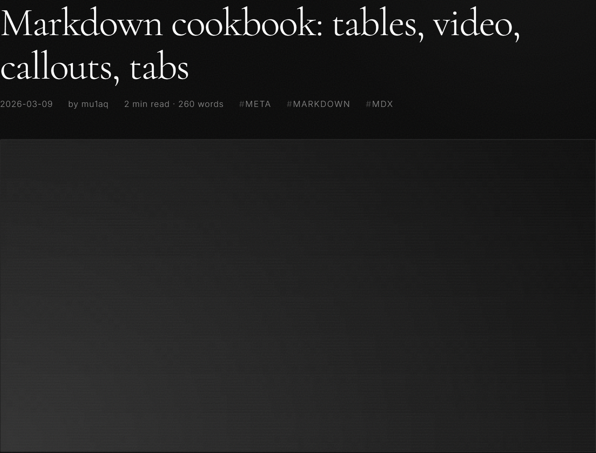

On the `/blog/` list card (with title, date, tags, description, Read more):

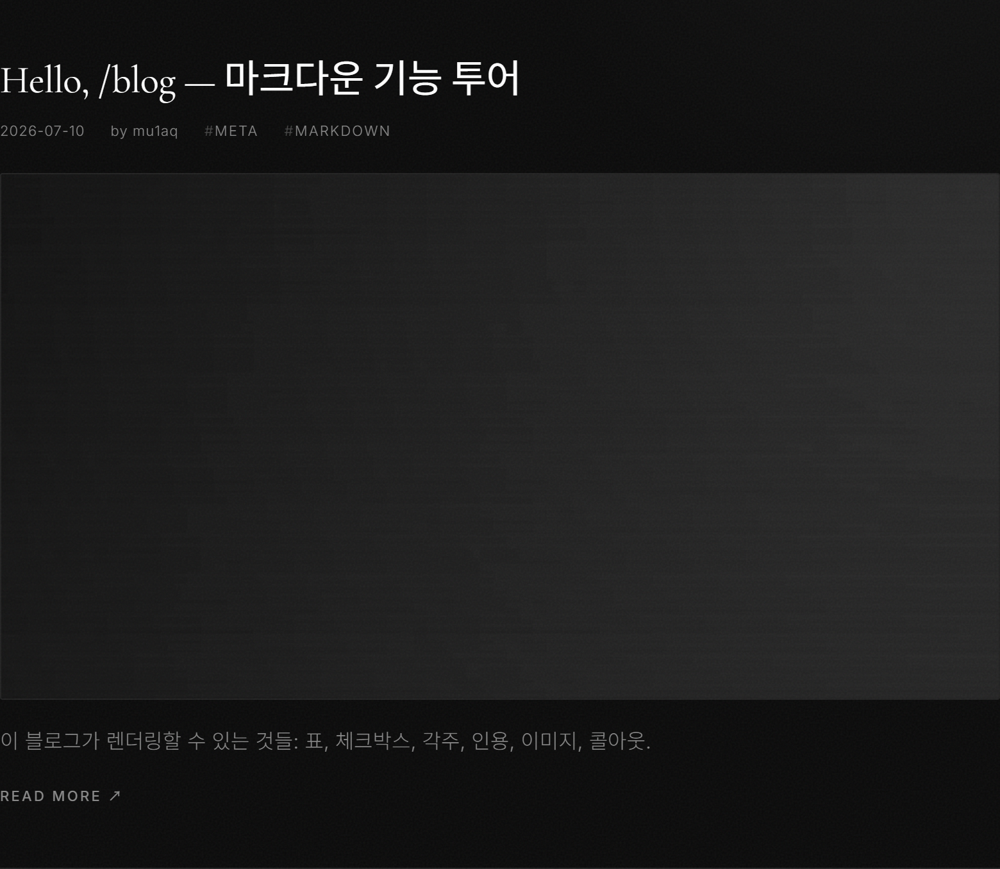

## Tags

Tags are a plain string array in frontmatter:

```yaml
tags: ["security", "exploit", "iot"]
```

They render as `#security #exploit #iot` chips in the post meta line (on the list
card and the post header). No tag pages / filtering — tags are labels only.
Empty (`[]`) or omitted = no chips.

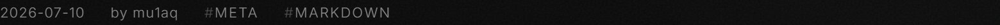

## Body — Markdown (works in `.md` and `.mdx`)

### Headings, TOC, heading links

Use `##` / `###` for sections. From them the blog auto-builds:
- an **in-content TOC box** at the top (click to jump; `###` tab-indented),
- a **floating right-side rail** (Notion-style: scroll-spy + hover-to-expand),
- **the heading text itself is a link** — click it to copy that section's URL
  (the address bar updates to `…#slug`). No `#` glyph; a short "link copied"
  toast confirms it.

`#` (h1) is reserved for the post title — don't use it in the body.

In-content TOC box:

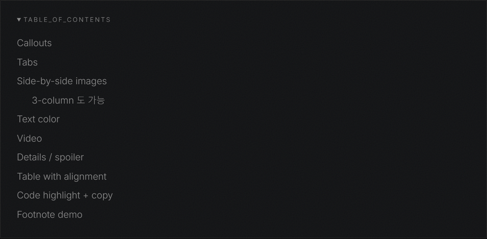

Floating right rail — collapsed (lines only) and hovered (labels expand):

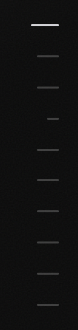
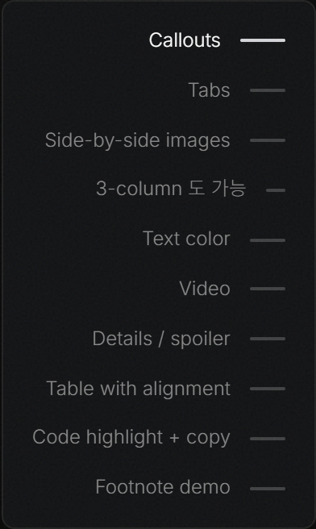

Click a heading → copies its URL, shows a toast:

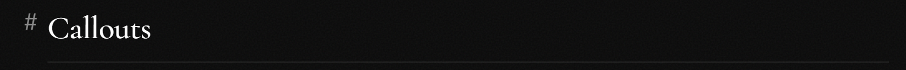

### Text, lists, quotes

```markdown
**bold**, `inline code`, [link](https://example.com)

- bullet
- list

1. numbered
2. list

- [x] done            ← task list (checkbox)
- [ ] todo

> blockquote (rendered as serif italic)
```

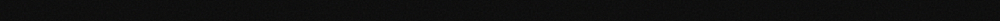

### Tables (GFM, with alignment)

```markdown
| exploit | class | CVSS | patched |
| :--- | :---: | ---: | :---: |
| DDNS pre-auth RCE | injection | 9.8 | yes |
| stack overflow | memory | 8.1 | yes |
```

`:---` left, `:---:` center, `---:` right. Scrolls horizontally on mobile.

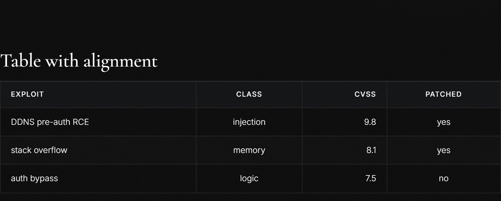

### Images in the body

Relative path, same folder as the post; optimized automatically:

```markdown

```

### Code blocks (highlight + copy + filename + line highlight)

    ```c title="overflow.c" {6}
    #include <string.h>

    void vuln(char *in) {
        char buf[64];
        // no bounds check — classic stack smash
        strcpy(buf, in);
    }
    ```

- language after the fence → syntax highlight,
- `title="overflow.c"` → filename frame,
- `{6}` or `{2,4-6}` → highlight those lines,
- every block gets a **copy button** automatically.

Inline `` `code` `` gets its own subtle background.

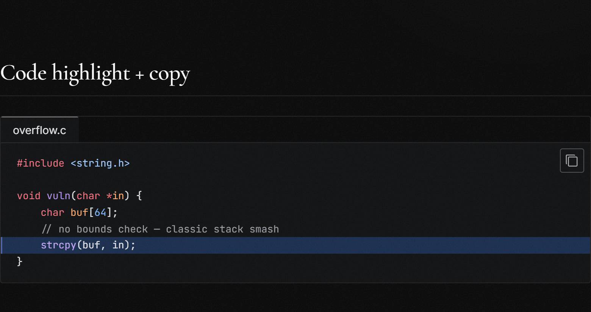

### Footnotes

```markdown
메모리 오염 버그는 여전히 큰 축이다[^1].

[^1]: 각주 본문. 글 하단에 모인다.
```

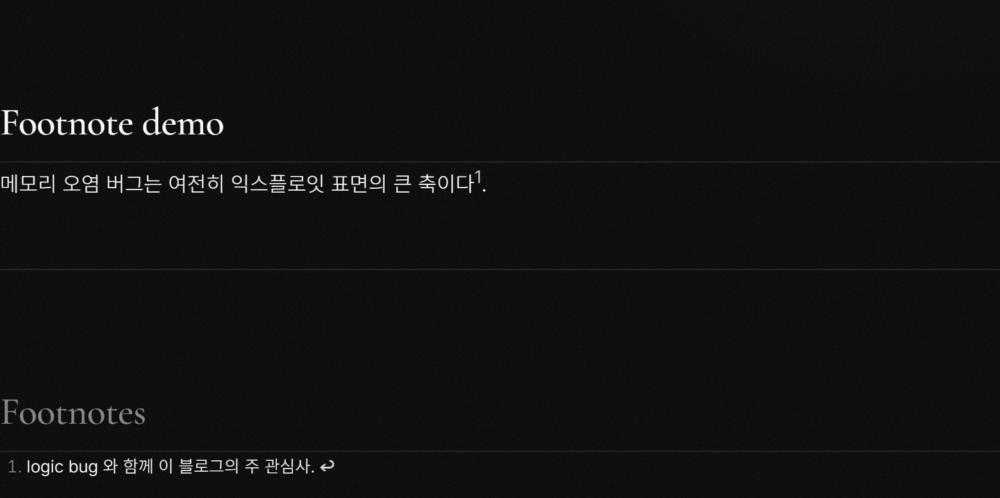

### Text color

- Plain `.md` — raw HTML span:
  ```markdown
  <span style="color:#c9a227">gold</span>
  ```
- `.mdx` — JSX style object (note the double braces):
  ```mdx
  <span style={{ color: '#c9a227' }}>gold</span>
  ```

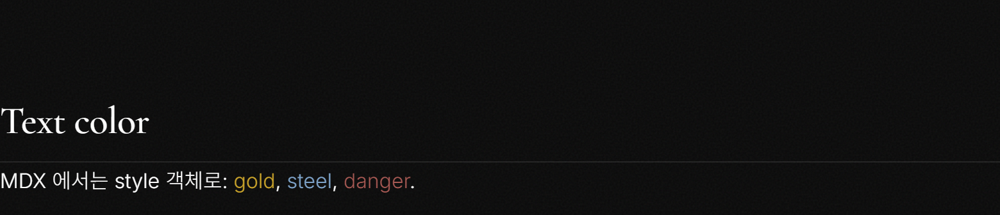

## MDX components (`.mdx` only)

Rename the file to `index.mdx` and import what you use at the top (below the
frontmatter). Paths are relative from `content/posts/<slug>/` → three levels up
to `components/`:

```mdx
import Callout from '../../../components/mdx/Callout.astro';
import Tabs from '../../../components/mdx/Tabs.astro';
import Tab from '../../../components/mdx/Tab.astro';
import Details from '../../../components/mdx/Details.astro';
import Video from '../../../components/mdx/Video.astro';
import ImageRow from '../../../components/mdx/ImageRow.astro';
```

### Callout — `info` / `warning` / `danger`

```mdx
<Callout type="info">정보성 노트.</Callout>
<Callout type="warning" title="ASSUMPTION">커스텀 라벨도 가능.</Callout>
<Callout type="danger">실행 전 반드시 백업.</Callout>
```

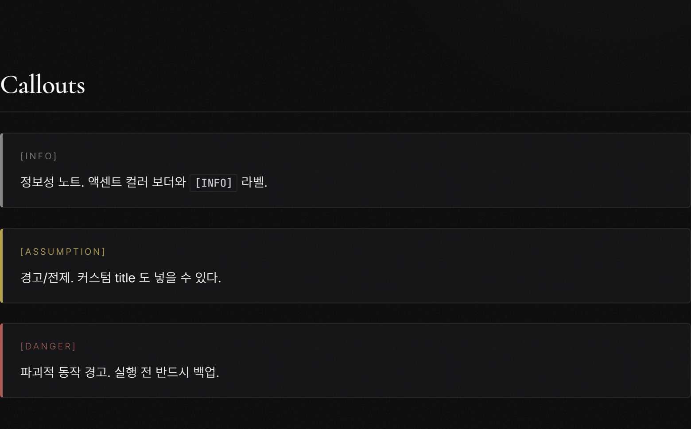

### Tabs

```mdx
<Tabs>
<Tab label="python">
```py
print("hello from python")
```
</Tab>
<Tab label="rust">
```rust
fn main() { println!("hello from rust"); }
```
</Tab>
</Tabs>
```

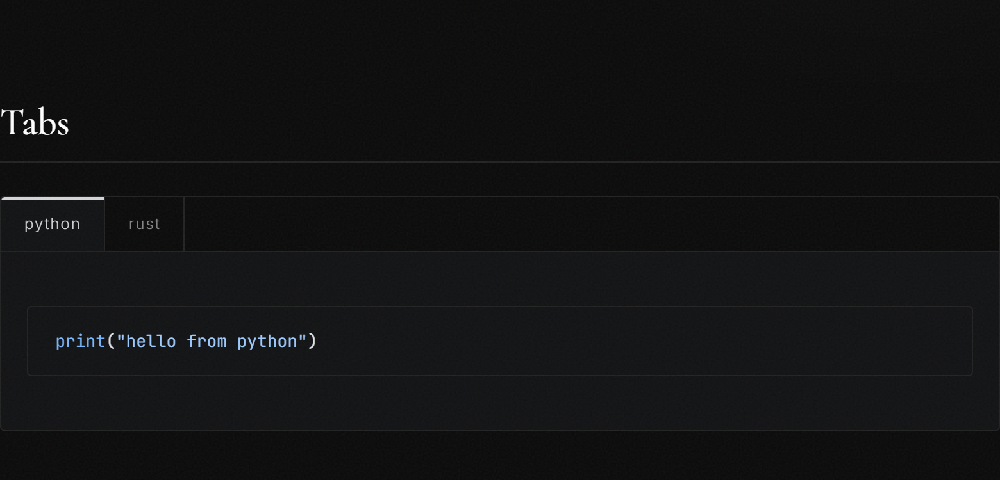

### Details / spoiler

```mdx
<Details title="payload 펼치기">
접혀 있다가 펼쳐지는 블록. 긴 로그·스포일러에.
</Details>
```

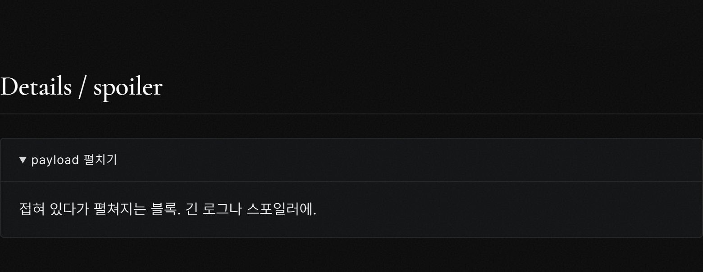

### Video — YouTube or local mp4

```mdx
<Video src="https://youtu.be/dQw4w9WgXcQ" title="responsive embed" />
<Video src="/blog/clips/demo.mp4" />
```

A YouTube URL → responsive `<iframe>`; anything else → `<video controls>`.


### ImageRow — side-by-side images

**Separate each image with a blank line** — adjacent image lines merge into one
paragraph and won't split:

```mdx
<ImageRow>


</ImageRow>
```

Works with 2, 3, … images; `gap` prop overrides the default 14px. The gap is the
visible split down the middle.

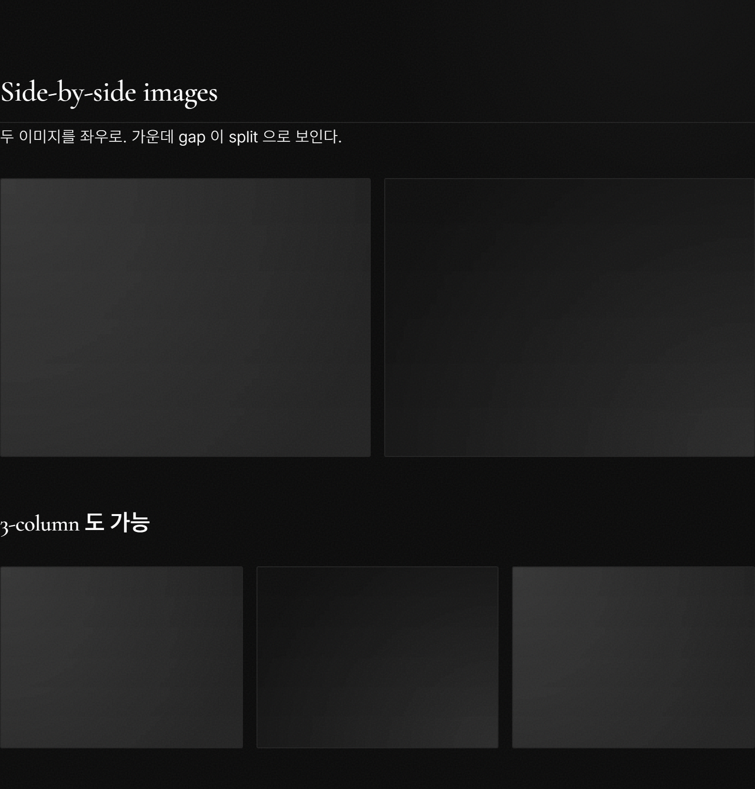

### Add a new MDX component

Drop `MyThing.astro` into `src/components/mdx/`, then
`import MyThing from '../../../components/mdx/MyThing.astro'` in any `.mdx`. No
central registration.

## Automatic on every post

- **Reading time + word count** — shown in the post header (computed by
  `remark-reading-time`).
- **Prev / next** links at the bottom.
- **Post-list drawer** — top-right hamburger on every page; current post
  highlighted. New posts appear automatically.
- **OG / Twitter meta** — title, description, absolute cover image.

Post-list drawer (top-right hamburger, current post highlighted):

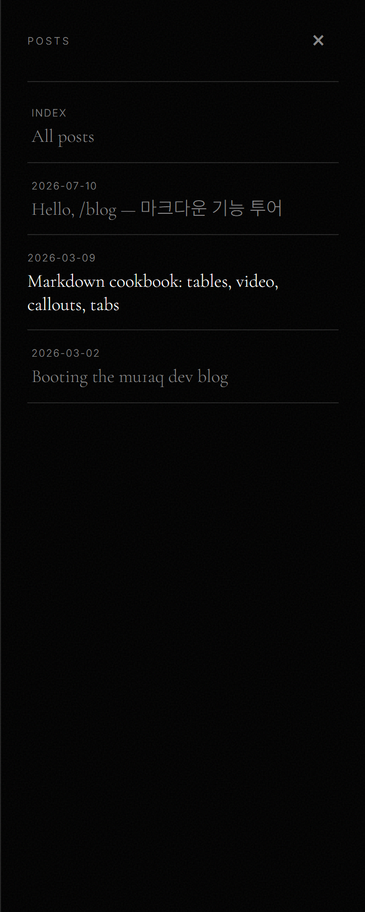

Prev / next at the bottom of each post:

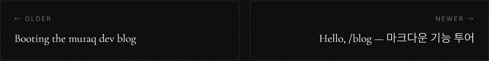

## Deploy

```bash
# from blog-src/
npm run build        # → dist/ (gitignored), then postbuild copies it to ../blog/

# from the repo root
git add blog blog-src .nojekyll
git commit -m "blog: <what changed>"
git push             # pushing to main deploys
```

Commit **both** `blog/` (published) and `blog-src/` (source + your new post).

**Builds are safe.** Astro builds into a throwaway `dist/` (gitignored); postbuild
copies it into the committed `blog/` **only on success**. A broken post (bad
frontmatter, MDX typo) fails the build and leaves your published `blog/`
untouched — it never gets wiped. Fix and rebuild. (If `blog/` ever does get lost,
`git restore blog` brings it back.)

A build regenerates the **whole** `blog/` from every post in
`src/content/posts/` — it's a static-site generator, not an incremental add.
Keep every post you want published in the source; deleting a source post drops
it from the next build.

### `.nojekyll` — keep it

Astro emits hashed assets under `blog/_astro/`. GitHub Pages runs Jekyll, which
ignores folders starting with `_`, so **without a repo-root `.nojekyll` the blog
loads unstyled**. `scripts/postbuild.mjs` writes it every build; keep it committed.

### Verify before pushing

```bash
# from the repo root:
python -m http.server 3100
# open http://localhost:3100/blog/ — reproduces the Pages /blog subpath;
# check assets load and internal links resolve.
```

## Theme

All colors are CSS variables at the top of `src/styles/global.css`
(`--bg`, `--fg`, `--fg-muted`, `--accent`, `--border`), matching the portfolio.
A `:root[data-theme='light']` block is stubbed for a future light toggle — the
structure is there; no toggle button is wired yet.
